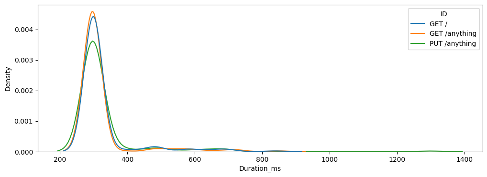

# 🚀 HTTPster

## 🎯 About
HTTPster is like your Swiss Army knife for HTTP load testing - but cooler! Born out of frustration with traditional tools like `ab` and `wrk` that give you about as much detail as a weather forecast from a magic 8-ball.

## 🌟 Key Features
- Multi-threaded request execution
- Detailed timing metrics for each request
- CSV output for data nerds (we know you love spreadsheets!)
- Support for all HTTP methods (because POST isn't the only cool kid)
- Custom headers and body support


## 🏃‍♂️ Quick Start
```shell
# Clone and build your very own HTTPster
git clone https://github.com/axent-pl/httpster
cd httpster
make build

# Let's make some noise!
cat examples/example.json | bin/httpster -duration=60s -threads=2 1> data.csv 2> error.log

# If lost, just ask for help
bin/httpster --help
```

## 📝 Input `stdin`
Feed HTTPster with a JSON array of request definitions to the `stdout`. Here's a simple example:
```json
[
    {
        "id": "my-awesome-request",
        "url": "http://api.example.com/unicorns",
        "method": "POST",
        "headers": {
            "Content-Type": "application/json",
            "X-Magic-Header": "🌈"
        },
        "body": "{\"wants\": \"rainbow\"}"
    }
]
```

Schema:
```json
{
  "$schema": "http://json-schema.org/draft-04/schema#",
  "type": "array",
  "items": [
    {
      "type": "object",
      "properties": {
        "id": {
          "type": "string"
        },
        "url": {
          "type": "string"
        },
        "method": {
          "type": "string"
        },
        "headers": {
          "type": "object"
        },
        "body": {
          "type": "string"
        }
      },
      "required": [
        "url",
        "method"
      ]
    }
  ]
}
```

## 📊 Output `stdout` and `stderr`
HTTPster spits out `CSV` data to `stdout` that looks like this:

| Column	| Description |
|---------|-------------|
|  ID	| Your request identifier | 
|  StartTime	| When the magic happened (ISO 8601) | 
|  Duration_ns	| Total request time (nanoseconds) | 
|  ConnDuration_ns	| Connection establishment time | 
|  DialDuration_ns	| TCP handshake time | 
|  DNSDuration_ns	| DNS lookup time | 
|  RequestDuration_ns	| Time spent sending the request | 
|  Status	| HTTP status message | 
|  StatusCode	| HTTP status code | 
|  Error	| Error message (if any) | 

Example output:

```csv
ID,StartTime,Duration_ns,ConnDuration_ns,DialDuration_ns,DNSDuration_ns,RequestDuration_ns,Status,StatusCode,Error
GET /,2025-05-08T10:48:04+02:00,243971334,123593959,119537375,2674750,1451209,200 OK,200,
GET /,2025-05-08T10:48:04+02:00,256501709,130761917,126730792,2680500,188042,200 OK,200,
```

Any errors goes to `stderr`

## 🔬 Analysis
Want to make sense of all those numbers? Here's a Python snippet to get you started:

```python
import pandas as pd
import seaborn as sns
import matplotlib.pyplot as plt

# Load your data
df = pd.read_csv("data.csv")
df['StartTime'] = pd.to_datetime(df['StartTime'])

# Create a fancy plot
sns.kdeplot(data=df, x='Duration_ns',hue="ID")
plt.title('Request Duration Distribution')
plt.show()
```
