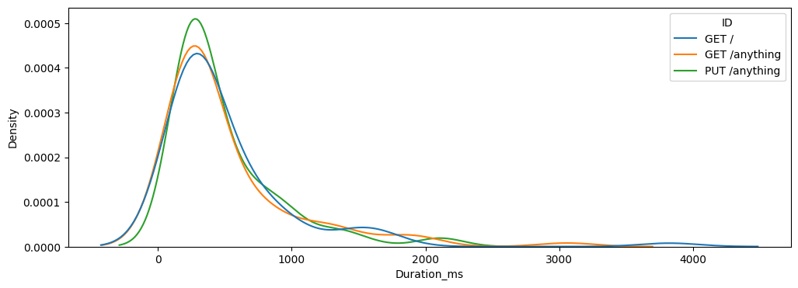

# HTTPster

A simple load test tool that executes multiple requests with any method (GET, POST, PUT, ...) and returns raw data to perform detailed analysis.

## Motivation

I attempted to conduct load tests to evaluate the latency introduced by some selected API Gateways.
Unfortunately, tools like `ab` and `wrk` did not provide sufficient information — offering basically mean and standard error — and their output was less than ideal to work with - formated text.
This prompted the idea to develop a simple tool that could provide raw data for more thorough analysis.

## Usage

```shell
# build
make build

# check for options
bin/httpster --help

# run
cat examples/example.json | bin/httpster -duration=60s -threads=2 > examples/out/data.csv
```

Please note the `1>` as all the metrics are sent to the `stdout` whereas all the errors to `stderr`.

## Analysis

An example notebook containing analysis of the `HTTPster` output can be found [here](https://github.com/axent-pl/httpster/blob/main/examples/analyse.ipynb).

To load the data from `HTTPster` please start with the following Python snippet:
```python
import pandas as pd

df = pd.read_csv("out/data.csv")
df['StartTime'] = pd.to_datetime(df['StartTime'])

```

From this point you can start your analysis - plot all the distributions, check for anomalies, etc.



## Input format

Request definitions are supposed to be provided via `stdin` in a `JSON` format with following schema:

```json
{
  "$schema": "http://json-schema.org/draft-04/schema#",
  "type": "array",
  "items": [
    {
      "type": "object",
      "properties": {
        "id": {
          "type": "string"
        },
        "url": {
          "type": "string"
        },
        "method": {
          "type": "string"
        },
        "headers": {
          "type": "object"
        },
        "body": {
          "type": "string"
        }
      },
      "required": [
        "url",
        "method"
      ]
    }
  ]
}
```

Example
```json
[
    {
        "id": "PUT /anything",
        "url": "http://httpbin.org/anything",
        "method": "PUT",
        "headers": {
            "Content-Type": "application/json"
        },
        "body": "{\"data\": {\"key1\":\"val1\"}}"
    }
]
```

## Output format

`HTTPster` ouutput is in `CSV` format to `stdout`. Any error encountered are outputed to `stderr`. Below is an example of the output

```csv
ID,StartTime,Duration_ns,ConnDuration_ns,DialDuration_ns,DNSDuration_ns,RequestDuration_ns,Status,StatusCode,Error
GET /,2025-05-08T10:48:04+02:00,243971334,123593959,119537375,2674750,1451209,200 OK,200,
GET /,2025-05-08T10:48:04+02:00,256501709,130761917,126730792,2680500,188042,200 OK,200,
GET /anything,2025-05-08T10:48:04+02:00,232518542,115871875,114231875,1535625,124333,200 OK,200,
PUT /anything,2025-05-08T10:48:04+02:00,245792959,123022958,121187792,1640375,383083,200 OK,200,
GET /,2025-05-08T10:48:05+02:00,247554000,120774417,118482625,2106958,158167,200 OK,200,
GET /anything,2025-05-08T10:48:05+02:00,250008542,124358750,123072792,1106709,244958,200 OK,200,
PUT /anything,2025-05-08T10:48:05+02:00,240371167,118086500,115311458,2569833,161000,200 OK,200,
GET /anything,2025-05-08T10:48:04+02:00,1330247167,120577708,118012000,2356041,165500,200 OK,200,
GET /,2025-05-08T10:48:05+02:00,352022667,124687292,122187250,2366959,96625,200 OK,200,
PUT /anything,2025-05-08T10:48:05+02:00,252183834,124394000,123091667,1170917,211125,200 OK,200,
GET /,2025-05-08T10:48:06+02:00,244071209,119660500,117751583,1733208,74208,200 OK,200,
GET /anything,2025-05-08T10:48:06+02:00,251724500,126146500,122811917,3204750,55125,200 OK,200,
PUT /anything,2025-05-08T10:48:06+02:00,248301708,123567542,122412833,1040125,140375,200 OK,200,
```